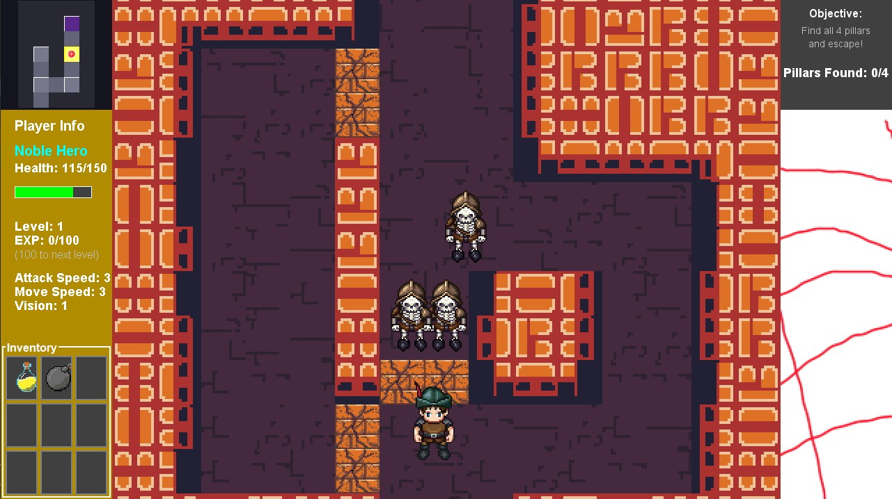
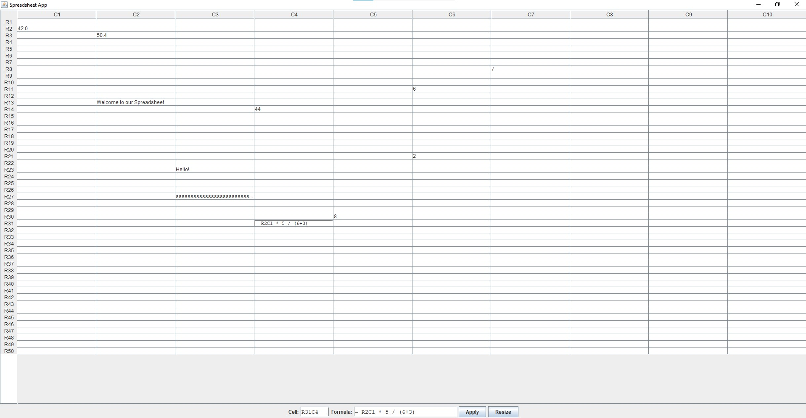
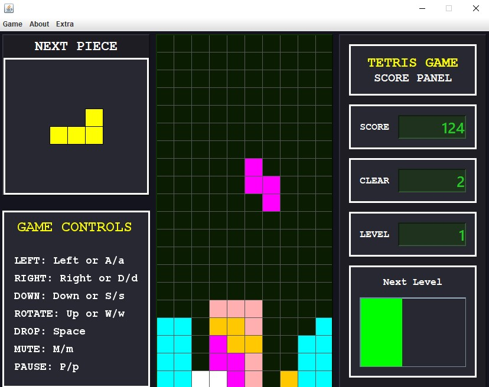

# David Norman's Portfolio  

  
  &nbsp;&nbsp;
  

<table>
  <tr>
    <!-- IMAGE CELL -->
    <td width="70%">
      
    </td>
    <!-- TEXT CELL -->
    <td width="45%" valign="top">
      <h2>Introduction</h2>
      

        My name is David Norman. I am currently a senior at the University of Washington, Tacoma, 
        pursuing my Bachelor of Arts in Computer Science. I have a minor in Business Data Analytics, 
        leading me to be someone who is dedicated to leveraging data analytics to drive sustainable 
        business growth and inform strategic decisions.
      

      <h2>About Me</h2>
      

        I have two children, a 5 year old daughter and a 1 year old son. There are many hobbies I enjoy 
        such as rock climbing, soccer, and video games. Since I grew up surrounded by technology, my 
        father and siblings were always deeply engaged with computers and how they worked, and 
        naturally, I followed their lead. From a young age, I’ve been fascinated by how computers 
        operate and how meaningful insights can be created from the data they provide. This curiosity 
        has evolved into a passion for using technology and data to develop innovative ideas and make 
        informed decisions about the future.
      

    </td>
  </tr>
</table>

<table>
  <tr>
    <td width="40%">
      
    </td>
    <td width="60%" valign="top">
      <h3>Drippy Spelunk Video Game</h3>
      <ul>
        <li><strong>Project:</strong> https://github.com/David-Norm/DrippySpelunk</li>
        <li>This project is a Dungeon Crawler styled game created in Java with a SQL database implementation where a character runs around a dungeon collecting four pillars. After collecting all pillars, the exit door opens.</li>
        <li>Includes features like chests with items, custom dungeon generation, and turn-based enemy combat.</li>
        <li><strong>Implemented Design Patterns:</strong> MVC, Singleton, Factory, Facade</li>
        <li><strong>Key Learnings:</strong> Design patterns, SQL database implementation, OOP</li>
        <li><strong>Technologies:</strong> Java, SQL, IntelliJ IDEA, GitHub</li>
      </ul>
    </td>
  </tr>
</table>

<table>
  <tr>
    <td width="40%">
      
    </td>
    <td width="60%" valign="top">
      <h3>Spreadsheet Application</h3>
      <ul>
        <li><strong>Project:</strong> https://github.com/David-Norm/Spreadsheet</li>
        <li>A Java-based spreadsheet modeled after Excel, evaluating formulas using a tree-structured data model with an adjacency-list graph and topological sorting for dependency resolution.</li>
        <li>Includes a custom grammar and expression parser for formula evaluation.</li>
        <li><strong>Key Learnings:</strong> Grammar implementation, GUI development, trees & graphs</li>
        <li><strong>Technologies:</strong> Java, IntelliJ IDEA, GitHub</li>
      </ul>
    </td>
  </tr>
</table>

<table>
  <tr>
    <td width="40%">
      
    </td>
    <td width="60%" valign="top">
      <h3>Tetris Game</h3>
      <ul>
        <li><strong>Project:</strong> https://github.com/David-Norm/Tetris</li>
        <li>A Java Tetris game built to deepen understanding of OOP. Includes Normal and Hyper Mode, optional music, a grid-assist option, and a level/score progression bar.</li>
        <li><strong>Key Learnings:</strong> State Design Pattern, OOP principles, audio integration</li>
        <li><strong>Technologies:</strong> Java, IntelliJ IDEA, GitHub</li>
      </ul>
    </td>
  </tr>
</table>

## Skills
### Languages
Java, SQL, Python, R
### Frameworks
MySQL, RapidMiner
### Developer Tools
Git, IntelliJIDEA, Eclipse, AIStudio, Maven

## Experience
I have developed substantial experience through a wide range of coding projects at the University of Washington Tacoma. These projects have strengthened my understanding of object-oriented programming, design patterns, and database implementation across multiple programming languages. They have also provided practical, hands-on exposure to building software systems, collaborating in team environments, and applying theoretical concepts to real world problems.

## Resume
You can view my resume here: [Resume (PDF)](./David%20Norman%20-%20Resume.pdf)

## Contact
- Email: david.norm2001@gmail.com
- [LinkedIn](linkedin.com/in/david-norm) 
- [GitHub](github.com/david-norm) 
